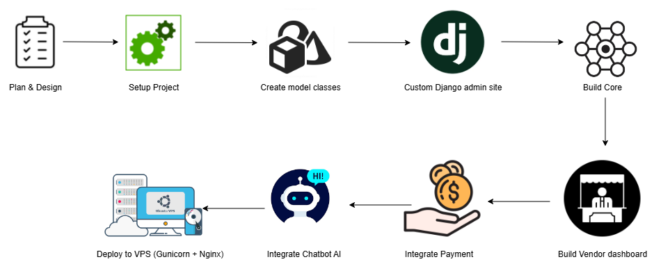
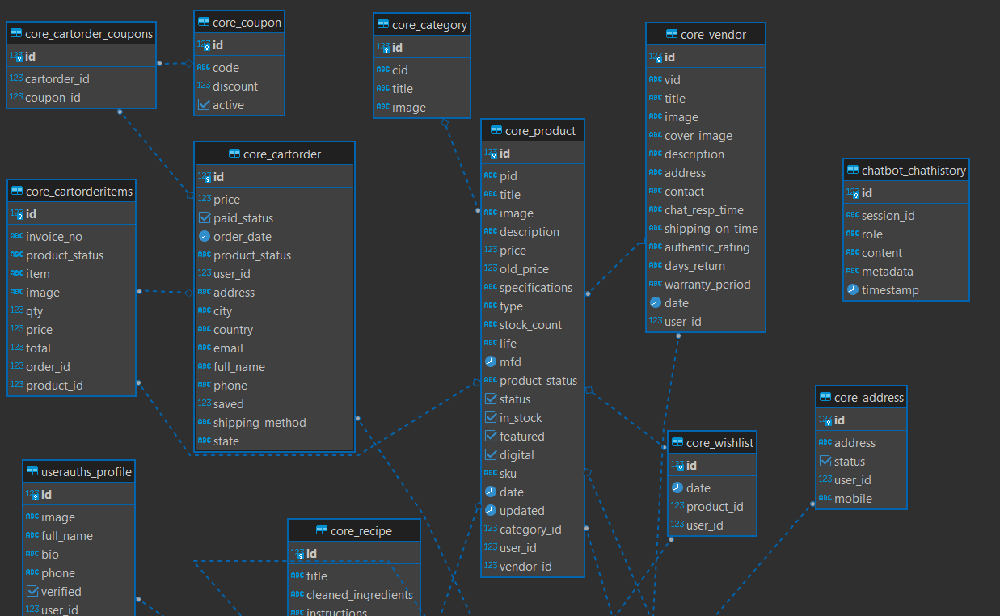
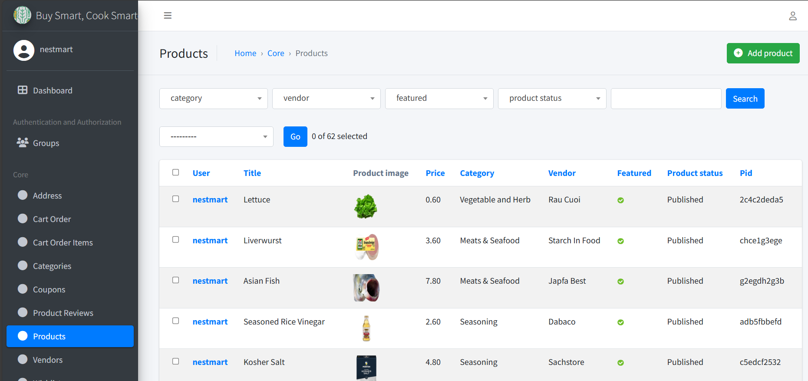
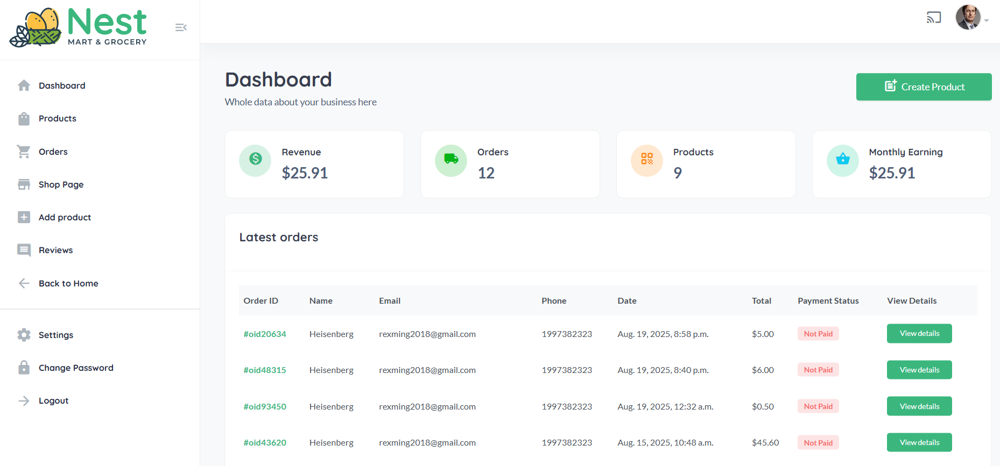
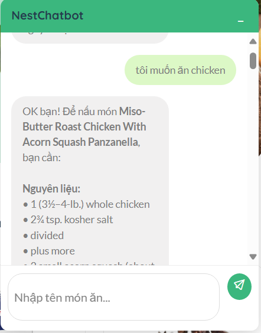
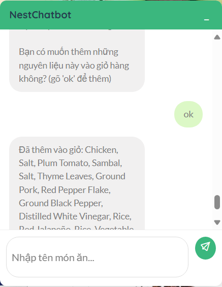

# Food E-commerce Website

## Table of Contents
- [Food E-commerce Website](#food-e-commerce-website)
  - [Table of Contents](#table-of-contents)
- [1. Context](#1-context)
- [2. Implementation](#2-implementation)
  - [2.1. Plan \& Design](#21-plan--design)
  - [2.2. Setup Project](#22-setup-project)
  - [2.3. Create Model Classes](#23-create-model-classes)
  - [2.4. Custom Django Admin Site](#24-custom-django-admin-site)
  - [2.5. Build Core](#25-build-core)
  - [2.4. Payment Gateway](#24-payment-gateway)
  - [2.5. Deployment](#25-deployment)
  - [2.6. Build Vendor Dashboard](#26-build-vendor-dashboard)
  - [2.7. Integrate Payment](#27-integrate-payment)
  - [2.8. AI Chatbot Integration](#28-ai-chatbot-integration)
  - [2.9. Deploy to VPS (Gunicorn + Nginx)](#29-deploy-to-vps-gunicorn--nginx)
- [4. Testing Guide](#4-testing-guide)
  - [4.1. Payment Testing](#41-payment-testing)
  - [4.2. Chatbot Testing](#42-chatbot-testing)
- [5. Skills and Achievements](#5-skills-and-achievements)
  - [Technical Stack \& Tools](#technical-stack--tools)
  - [Skills Gained](#skills-gained)

---

# 1. Context
Context:
* Developed a full-stack e-commerce website designed for users new to cooking, providing an integrated platform to not only purchase groceries but also receive suggestions for recipes and the necessary ingredients for each dish.  
* Unlike standard e-commerce websites, this platform integrates an **AI-powered chatbot** to assist beginners in cooking. The chatbot suggests recipes and required ingredients for each dish, and users can quickly add all items to the shopping cart for easier purchasing.  

---

# 2. Implementation

  
  <b>Figure 1:</b> Flow chart  

<!-- ## 2.1. User Features
* User registration & authentication.  
* Option to register as a **Vendor**.  
* Search products by name or category.  
* Add products to **shopping cart**.  
* Checkout with secure online payment.  
* Manage purchased **orders**.  -->

## 2.1. Plan & Design
At the beginning of the project, I defined the scope, user stories, and target features. Wireframes and an entity-relationship diagram (ERD) were prepared to map out how users, vendors, products, and orders would interact in the system. 

  
  <b>Figure 2:</b> ERD  

<!-- ## 2.2. Vendor Features
* Access to **dashboard** for sales management.  
* Add new products.  
* Process customer orders.  
* Generate **revenue reports**.   -->

## 2.2. Setup Project

The Django framework was configured with PostgreSQL as the database, virtual environments for dependency isolation, and version control using Git. Environment variables were set up to securely manage secrets and configuration values.

## 2.3. Create Model Classes

Core data models were designed in models.py for Users, Vendors, Products, Categories, Cart, Orders, Payments, etc. Relationships and constraints (foreign keys, indexes) were defined to ensure data integrity and scalability.

## 2.4. Custom Django Admin Site

The Django admin site was customized to manage products, vendors,  orders, etc effectively. Specific admin views, filters, and inline configurations were added to simplify management for administrators.

  
  <b>Figure 3:</b> Django Admin Site  

## 2.5. Build Core

The main business logic of the application was implemented, including:

* User registration, login, and vendor onboarding.

* Product catalog browsing and search functions.

* Shopping cart management (add, remove, update items).

* Order placement and order tracking system.
## 2.4. Payment Gateway
* Implemented **Stripe** for online payments.  
* Supports credit/debit card testing with sandbox credentials.  

## 2.5. Deployment
* Deployed on **Ubuntu VPS**.  
* Backend: **Django** with **Gunicorn**.  
* Reverse proxy: **Nginx**.  
* Persistent process management with **tmux**.  

## 2.6. Build Vendor Dashboard

A dedicated vendor dashboard was developed, enabling vendors to:

* Add and edit products.

* Manage incoming orders.

* View revenue reports and sales statistics.

* Review comments about products.

  
  <b>Figure 4:</b> Vendor Dashboard  

## 2.7. Integrate Payment

Stripe was integrated as the payment gateway. Users can securely pay for their orders using test cards, and the system listens to webhooks for order confirmation and stock deduction.

## 2.8. AI Chatbot Integration
* Integrated **Gemini API chatbot**.  
* Supports natural language prompts:  
  * Example: `"I want to eat Sandwich"` → chatbot suggests recipe & ingredients.  
  * `"Another dish"` → chatbot provides alternative recipes.  
  * `"ok"` → chatbot automatically adds suggested ingredients to the cart.  

    
  <b>Figure 5:</b> Recommand food ingredients and its recipe.  

    
  <b>Figure 6:</b> Automatically adds suggested ingredients to the cart  

## 2.9. Deploy to VPS (Gunicorn + Nginx)

For production, the system was deployed on an Ubuntu VPS:

* Gunicorn serves as the WSGI application server.

* Nginx works as the reverse proxy.

* Static/media files were configured.
---

# 4. Testing Guide

## 4.1. Payment Testing
* Select **Stripe Checkout** at payment.  
* Enter the following card details:  
  * **Card number**: `4242 4242 4242 4242`  
  * **Expiry date**: Any future date  
  * **CVV**: Any 3 digits  
  * **Name**: Any name  

## 4.2. Chatbot Testing
* Open the chatbot and enter a prompt, e.g., `"I want to eat Sandwich"`.  
* Verify the chatbot suggests the correct recipe.  
* Enter `"Another dish"` to get alternative suggestions.  
* Type `"ok"` to quickly add ingredients to the cart.  

---

# 5. Skills and Achievements

## Technical Stack & Tools
* **Python**: Core programming language for backend development and integration.
* **Django**: Backend architecture and core e-commerce modules.  
* **HTML Templates**: Server-side rendering with Django’s template engine.

* **Bootstrap + Custom CSS/SCSS**: Traditional frontend stack for responsive design and customized UI.
* **PostgreSQL**: Database for product, user, and order management.  
* **Stripe API**: Payment integration.  
* **Gemini API**: Chatbot AI integration.  
* **Gunicorn + Nginx**: Production deployment on Ubuntu VPS.  

## Skills Gained
* Built a full-featured Django e-commerce system using **Python** as the foundation.

* Hands-on integration with  **AI chatbot** for recipe & ingredient suggestions.

* Strengthened skills in **Python** programming, including ORM queries, API consumption, and backend logic.

* Enhanced ability to manage secure authentication, payment flows, etc.

* Improved knowledge of production deployment & server management.
